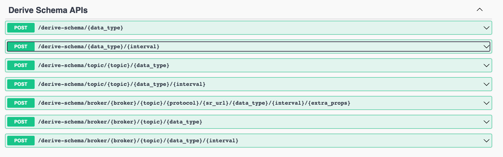

# Schema Registry Plugin Container

This project uses [Confluent Schema Registry Maven Plugin](https://docs.confluent.io/platform/current/schema-registry/develop/maven-plugin.html#sr-maven-plugin) to produce a message into a topic. As of right now, [schema-registry:derive-schema](https://docs.confluent.io/platform/current/schema-registry/develop/maven-plugin.html#schema-registry-derive-schema) has been implemented in this project. In the near future, I plan on having the remainder of the plugins setup as well. 

## How to use

Pull docker image:

```
docker push cdpop001/sr_plugins:tagname
```

Run docker image:
```
docker run --network plaintext_default -p 8080:8080 --name sr_plugins -d sr_plugins
```

Open browser and start using the REST API:

[http://localhost:8080/swagger-ui/index.html#/](http://localhost:8080/swagger-ui/index.html#/)

### Available APIs


### Sending message using API:


## API Variables


The following API variables are available depending on which API path you choose:
| Variable Name 	| Description                                                                                                    	| Valid values                	| Default values              	|
|---------------	|----------------------------------------------------------------------------------------------------------------	|-----------------------------	|-----------------------------	|
| data_type     	| Data type which will be used to generate the schema and send the message to the topic via the console producer 	| avro,json,protobuf          	| avro                        	|
| interval      	| How many times to send this message to the topic                                                               	| 1 - Integer.MAX_VALUE         	| 1                           	|
| broker        	| Broker hostname:port                                                                                           	| <hostname>:<port>           	| broker:9092                 	|
| topic         	| Topic name                                                                                                     	| *                           	| sample_topic                	|
| sr_url        	| Schema registry URL to talk to                                                                                 	| http(s)://<hostname>:<port> 	| http://schema-registry:8081 	|
| extra_props   	| Any extra console producer properties                                                                          	| Any extra properties        	|                             	|


## Limitations
- Nested data types is currently not supported due to console producer limitations and maven plugin limitations [link](https://docs.confluent.io/platform/current/schema-registry/develop/maven-plugin.html#primitive-data-types-mapping).
- This repository is meant as a POC and is not supported by any vendor at the time. 